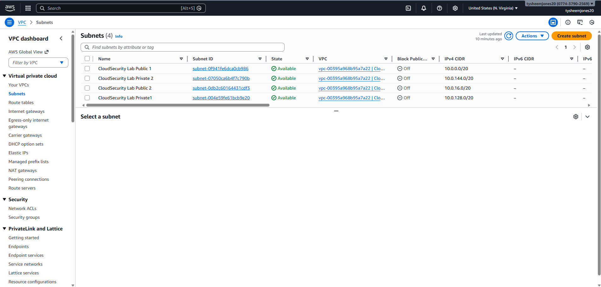
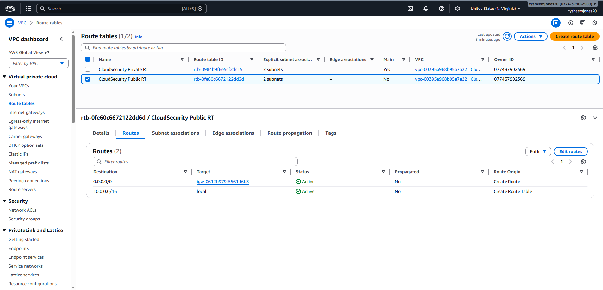
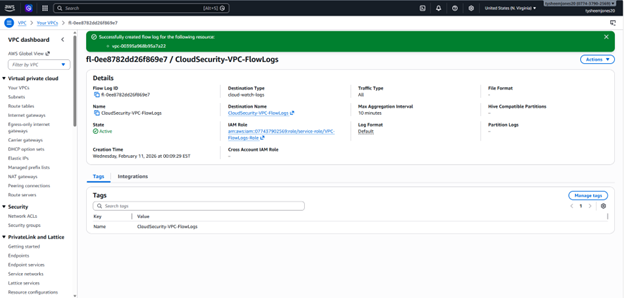
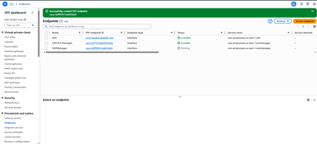
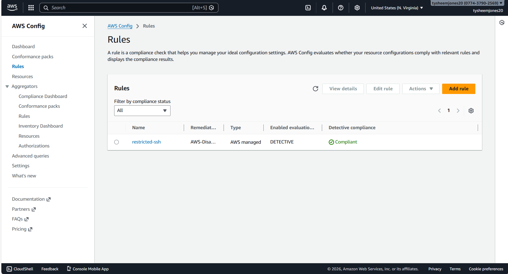

# AWS Cloud Security Architecture Lab

## Overview

This project is a hands-on cloud security lab where I designed and built a defense-in-depth AWS environment from the ground up.

The goal wasn’t just to deploy resources — it was to engineer security into the architecture at every layer: network segmentation, identity enforcement, threat detection, and continuous compliance monitoring.

This lab reflects how I approach security in real environments: build it secure, validate it, break it intentionally, and make sure it detects and corrects itself.

---

## Architecture Design

### VPC Segmentation

I created a custom VPC with structured CIDR planning and separated public and private subnets across multiple Availability Zones.

I implemented:

- Dedicated public and private route tables  
- Internet Gateway for controlled ingress  
- NAT Gateway for secure outbound access from private workloads  
- Strict security group boundaries  

Private instances were never directly exposed to the internet.

---

## Private Workload Deployment

I deployed a Linux EC2 instance into a private subnet with no public IP address.

Instead of exposing SSH:

- I attached an IAM role to the instance  
- I enabled AWS Systems Manager (SSM)  
- I created VPC Interface Endpoints (SSM, EC2 Messages, SSM Messages, STS)  

Identity replaced open network exposure.

---

## Logging & Visibility

To establish full control plane visibility, I configured centralized logging:

- Multi-region CloudTrail trail  
- Management events (Read and Write) enabled  
- S3 log storage  
- CloudWatch integration  
- VPC Flow Logs for network telemetry  

---

## Threat Detection Validation (GuardDuty)

I enabled Amazon GuardDuty to analyze CloudTrail events, DNS logs, and VPC Flow Logs.

To validate detection capabilities, I intentionally simulated root credential activity.

GuardDuty generated the finding:

**Policy:IAMUser/RootCredentialUsage**

This confirmed:

- Control plane activity was being monitored  
- Identity misuse detection was operational  
- Security telemetry was functioning in near real time  

---

## Continuous Compliance Monitoring (AWS Config)

I enabled AWS Config and created the managed rule:

**restricted-ssh**

This rule ensures that no security group allows SSH (port 22) from 0.0.0.0/0.

### Non-Compliant Simulation

I intentionally created a security group allowing public SSH access.

AWS Config:

- Detected the violation  
- Marked the resource as NON_COMPLIANT  
- Identified the insecure security group  

### Remediation Validation

I removed the public SSH rule and forced re-evaluation.

AWS Config returned the rule to COMPLIANT.

This completed the full governance lifecycle:

Policy defined → Misconfiguration introduced → Violation detected → Remediation performed → Compliance restored

---

## Key Security Concepts Demonstrated

- Defense-in-depth architecture  
- Least privilege enforcement  
- Identity-based access control  
- Control plane monitoring  
- Threat detection validation  
- Continuous compliance monitoring  
- Drift detection and remediation  

---
## 📸 Screenshots

### VPC Architecture

### Public and Private Subnets

### Public Route Table Configuration

### CloudTrail API Audit Logging

### VPC Flow Logs

### Secure Access via SSM and VPC Interface Endpoints

### GuardDuty Threat Detection Finding

### AWS Config - Non Compliant Security Group

### AWS Config - Compliance Restored

